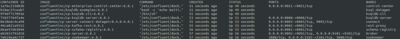
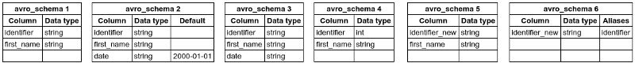

# kafka-schema-registry
Project containing Confluent Docker containers, Python Docker container, a python application to test schema compatibility according to Schema Registry compatibility modes.

# Setup Docker containers

1 - Clone the project.
```
git clone https://github.com/cordon-thiago/kafka-schema-registry
```

2 - Start Confluent Docker containers. It will start, among other services, the Kafka, Schema Registry, Zookeeper, and a Confluent control center UI available at http://localhost:9021/ where you can manage the Kafka cluster. Reference: https://github.com/confluentinc/cp-demo/tree/6.1.0-post
```
cd kafka-schema-registry/docker-confluent
docker-compose up -d
```

3 - Wait a few minutes until all the services are running. You can check if your services are running with the command `docker ps`. 

The output should resemble the following image.
 

If some service is not started, you can run the command `docker-compose up -d` and check again.

# Run avro schema compatibility test application

1 - Build the Python image which will be used to run the application.
```
cd kafka-schema-registry
docker build -t python:3.6 -f ./docker-python/Dockerfile .
```

2 - Run the application to test the schemas. 
```
docker run -it --net=docker-confluent_default  python:3.6 python /python-app/avroSchemaCompatibilityTest.py --topic_name test_compatibility --compatibility_type_list BACKWARD FORWARD
```
Parameters:

`--net`: network of the Confluent docker containers. The application needs to run in the same network as Confluent docker containers in order to access their services.

`--topic_name`: name of the topic to be created to run the tests.

`--compatibility_type_list`: list of compatibility modes that will be used to validate the schemas. Possible values: BACKWARD, BACKWARD_TRANSITIVE, FORWARD, FORWARD_TRANSITIVE, FULL, FULL_TRANSITIVE, NONE


The application has the following schemas predefined, but you can change it if you want to test other schemas. 
 

Output example:
```
Topic 'test_compatibility' created.


###################################
Running 'BACKWARD' schema check.
###################################
[
    {
        "schema_base": "avro_schema1",
        "schema_to_check": "avro_schema2",
        "compatibility_level": "BACKWARD",
        "is_compatible": true
    },
    {
        "schema_base": "avro_schema1",
        "schema_to_check": "avro_schema3",
        "compatibility_level": "BACKWARD",
        "is_compatible": false
    },
    {
        "schema_base": "avro_schema1",
        "schema_to_check": "avro_schema4",
        "compatibility_level": "BACKWARD",
        "is_compatible": false
    },
    {
        "schema_base": "avro_schema1",
        "schema_to_check": "avro_schema5",
        "compatibility_level": "BACKWARD",
        "is_compatible": false
    },
    {
        "schema_base": "avro_schema1",
        "schema_to_check": "avro_schema6",
        "compatibility_level": "BACKWARD",
        "is_compatible": true
    }
]


###################################
Running 'FORWARD' schema check.
###################################
[
    {
        "schema_base": "avro_schema1",
        "schema_to_check": "avro_schema2",
        "compatibility_level": "FORWARD",
        "is_compatible": true
    },
    {
        "schema_base": "avro_schema1",
        "schema_to_check": "avro_schema3",
        "compatibility_level": "FORWARD",
        "is_compatible": true
    },
    {
        "schema_base": "avro_schema1",
        "schema_to_check": "avro_schema4",
        "compatibility_level": "FORWARD",
        "is_compatible": false
    },
    {
        "schema_base": "avro_schema1",
        "schema_to_check": "avro_schema5",
        "compatibility_level": "FORWARD",
        "is_compatible": false
    },
    {
        "schema_base": "avro_schema1",
        "schema_to_check": "avro_schema6",
        "compatibility_level": "FORWARD",
        "is_compatible": false
    }
]
```
# Run producer application

In this project you can find an application to generate messages using one of the schemas predefined. To run the application, follow these steps:
```
docker run -it --net=docker-confluent_default  python:3.6 python /python-app/messageProducer.py --topic_name test_events --schema_name avro_schema1 avro_schema2 --compatibility_type FORWARD --qty_messages 5
```
Parameters:

`--topic_name`: name of the topic where the messages will be created. If this topic exists it will be deleted and recreated to ensure it is clean.

`--schema_name`: a list of schema names based on the functions under dataGenerator module with the predefined schemas.

`--compatibility_type`: the compatibility mode that will be used to register the schemas. Possible values: BACKWARD, BACKWARD_TRANSITIVE, FORWARD, FORWARD_TRANSITIVE, FULL, FULL_TRANSITIVE, NONE

`--qty_messages`: number of messages to be generated for each schema.

Output example:
```
Topic 'test_events' deleted.
Topic 'test_events' created.
###################################
Generating messages for schema 'avro_schema1'.
###################################
Message delivered to test_events [0]
Message delivered to test_events [0]
Message delivered to test_events [0]
Message delivered to test_events [0]
Message delivered to test_events [0]
###################################
Generating messages for schema 'avro_schema2'.
###################################
Message delivered to test_events [0]
Message delivered to test_events [0]
Message delivered to test_events [0]
Message delivered to test_events [0]
Message delivered to test_events [0]
```
# Stop Docker containers

1 - To stop Confluent docker containers:
```
cd kafka-schema-registry/docker-confluent
docker-compose down
```
